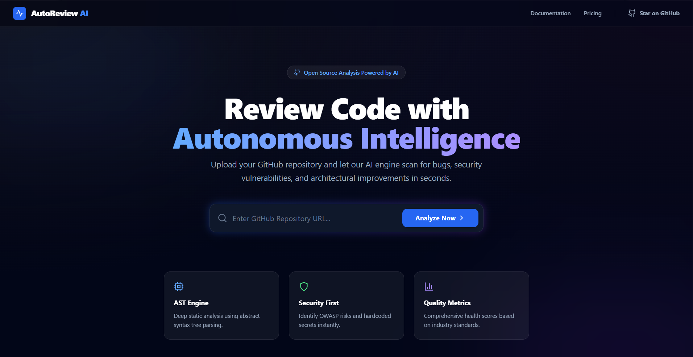
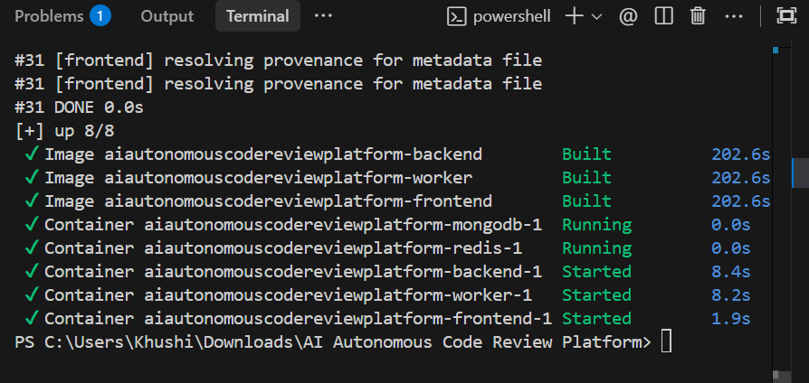
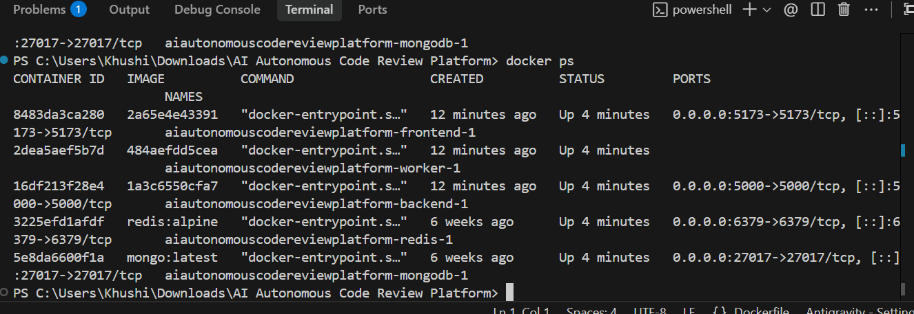
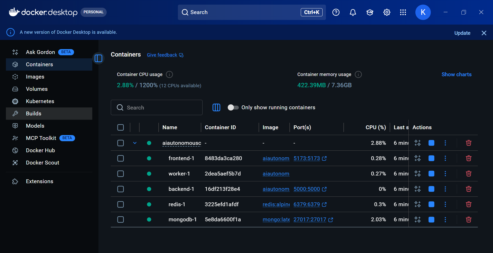

# AI Autonomous Code Review Platform (Free AI Edition)

An advanced AI-driven code analysis tool that parses GitHub repositories and detects bugs, security risks, performance issues, and structural vulnerabilities.

## 🚀 Recent Updates: Free AI Support
This platform now supports **Groq**, allowing you to perform high-quality AI code reviews for **FREE**. We have also implemented a **"Token-Saver" mode** that intelligently selects only the most complex files for AI review while using free AST scanning for everything else.

---

## 📸 Project Showcase
### Landing Page


---

## 🎓 Assignment Proof (Docker Requirements)

### 1. Docker Image Build


### 2. Running Containers


### 3. Docker PS Output


### 4. Docker Desktop Status


---

## 🛠️ Setup and Run locally

### 1. Start Everything with Docker
Ensure you have your `GROQ_API_KEY` in the `.env` file, then run:
```bash
docker-compose up --build -d
```
Navigate to `http://localhost:5173/` inside your browser!

### 2. Manual Setup (Alternative)
- **Backend**: `cd backend && npm install && npm run dev`
- **Worker**: `cd workers && npm install && npm start`
- **Frontend**: `cd frontend && npm install && npm run dev`

## 🛡️ Analysis Engine
1. **AST Static Scanner**: (Free & Fast) Detects structural issues like nested loops, unused variables, and function length.
2. **AI Logic Engine**: (Powered by Groq/Llama-3) Detects complex logical bugs, security vulnerabilities (XSS, SQLi), and edge cases.
3. **Health Scoring**: Generates a 0-100 quality score based on detected issues.
